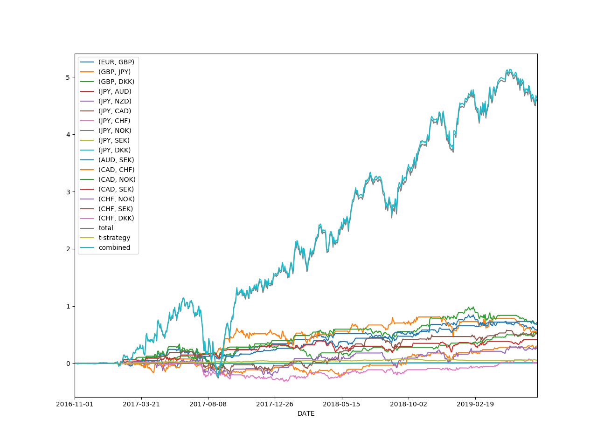

## Pair_strategy plus T-quantile_strategy

### Group Members:

- **junjie He, Hao Zheng, Tianzhen Ni, Changhan Shan, Yi Lin**

### Performance Overview:

- |      Strategy       | returns (unit) | sharpe_ratio |
  | :-----------------: | :------------: | :----------: |
  |   Pairs Strategy    |     3.9954     |    1.2485    |
  | T-quantile_Strategy |     0.0504     |    0.5863    |
  |  Combined_Strategy  |     4.0605     |    1.2394    |

- Pay attention that we assume that the initial asset is 0, and the return obtained is the ratio of the return under the unit leverage
- 

### How to run the strategy

- The **.ipynb**  file is a notebook that contain all the code for your overview without the output of position and net-value. And the **.py** file are individual codes for two strategies and combined strategy with the output of netvalue

- Data_input: **forward_rate.scv ； fair_price.csv**
- Data_output:  **t-quantile.csv**  ；**strategy_net_value.csv ；position_daily.csv**

- We have already put all the data you need together with the code.
- First, you should run the **t_strategy.py**, which use the data(forward_rate.scv and fair_price.csv) , and this code will generate **t-quantile.csv** file which will be used in **Strategy_performance.py**. Then you can directly run the **Strategy_performance.py** and this code will generate the picture above, which show you the pairs strategy's performance and the combined-strategy performance. Aslo, this code will generate the **position history and daily netvalue of Strategy and sharpe_ratio.** which are **strategy_net_value.csv and position_daily.csv**
- please use python 3.6 or updated version.
- For more details, you can know through the note in the code.